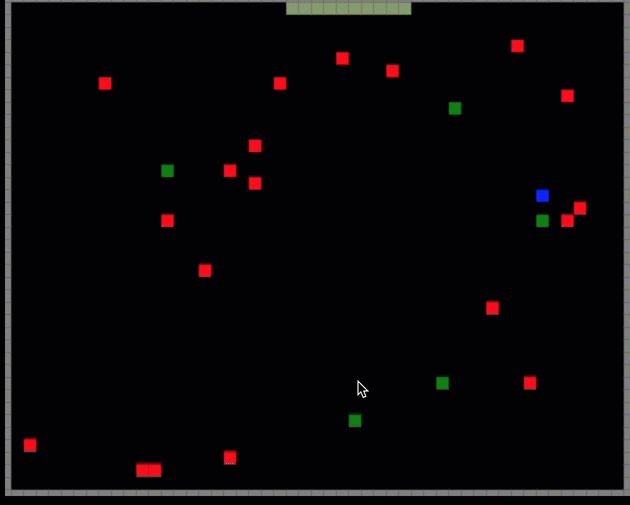

# Snakes on a plane
------
[](https://circleci.com/gh/electron/electron/tree/master)
[](https://ci.appveyor.com/project/electron-bot/electron-ljo26/branch/master)


-------

## Description

The game "Snakes on a plane" brings you the traditional game Snakes with a twist. This game is about a snake who lives in a forked github repo somewhere in the cloud. It wanted to travel the world hence got onto the Expedia plane. By playing this awesome game, you would be experiening the exciting journey of the snake on a 2D plane.

Follow [@SnakesOnAPlane](https://twitter.com/snakesonaplane) on Twitter for important
announcements.

### Screenshot



> Team Members : 
* Pallab Muhamud
* Ankit Ghosalkar
* Raksha Nagesh Bysani 

| Photo              | Name             | Role          |
|--------------------|------------------|---------------|
|  | Pallab Mahmud | Dev |
|  | Raksha Nagesh Bysani  | Dev |
|  | Ankit Ghosalkar | Dev |

This project adheres to the Contributor Covenant
[code of conduct](https://github.com/pmahmud/thegame/blob/master/CODE_OF_CONDUCT.md).
By participating, you are expected to uphold this code. Please report unacceptable
behavior to [pallmahmud@gmail.com](mailto:pallmahmud@gmail.com).

## Quick start

Clone the repo and run the following command on your terminal to run the game.

```sh
git clone https://github.com/pmahmud/thegame
cd thegame
npm install
npm start
```

## Contributing

If you are interested in reporting/fixing issues and contributing directly to the code base, please see [CONTRIBUTING.md](CONTRIBUTING.md) for more information on what we're looking for and how to get started.

## Community

Info on reporting bugs, getting help, finding third-party tools and sample apps,
and more can be found in the [support document](docs/tutorial/support.md#finding-support).

## License

[MIT](https://github.com/electron/electron/blob/master/LICENSE)
